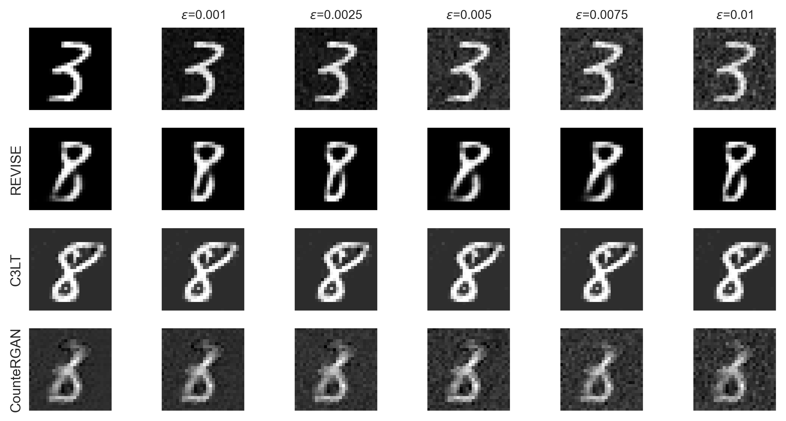

<!-- 
This README file provides an overview of the repository, which includes the source code and results of an empirical study. 
The study is described in the paper titled "Robustness Evaluation of Counterfactual Explanations from Generative Models: An Empirical Study". 
-->
This repository contains the source code and results of empirical study described in the paper "Robustness Evaluation of Counterfactual Explanations from Generative Models: An Empirical Study". 

# Structure
The ```src``` package has the following structure that helps to replicate the experiments for the robustness estimation of counterfactual explanations.  
- ```datasets```: contains API for MNIST, FashionMNIST, and DermaMNIST datasets
- ```models```: stores predictive models (SimpleCNN and ResNet50)
- ```cf_methods```: comprises of adapted methods for the geenration of counterfactual explanations
- ```evaluation```: functions  with robustness evaluation metrics 
- ```utils```: contains helper functions

# Usage
In order to use ```src``` as a module for running experiments on evaluation of the present generative models that produce counterfactual explanations, one is required to execute  ```pip install -e .``` in the folder where the ```setup.py``` file is located. 
Run ```pip install -r requirements.txt``` to install necessary packages. 

# CF generation models
In this project, we examined the following models:

1) REVISE [1]
2) CounteRGAN [2]
3) C3LT [3]

The following figure shows a factual instance from the test set (top left), slightly perturbed with different noise magnitudes as described in the robustness evaluation. Generated explanations targeting class 8 from the original and perturbed instances are presented for the three examined algorithms. This visualization helps assess the perceptual quality of counterfactual explanations before evaluating algorithmic robustness.




# *References*

[1] - Joshi, S., Koyejo, O., Vijitbenjaronk, W., Kim, B., & Ghosh, J. (2019). Towards realistic individual recourse and actionable explanations in black-box decision making systems. arXiv preprint arXiv:1907.09615.

[2] - Nemirovsky, D., Thiebaut, N., Xu, Y., & Gupta, A. (2022, August). Countergan: Generating counterfactuals for real-time recourse and interpretability using residual gans. In Uncertainty in Artificial Intelligence (pp. 1488-1497). PMLR.

[3] - Khorram, S., & Fuxin, L. (2022). Cycle-consistent counterfactuals by latent transformations. In Proceedings of the IEEE/CVF Conference on Computer Vision and Pattern Recognition (pp. 10203-10212).


